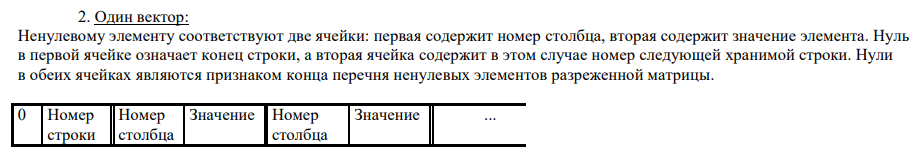
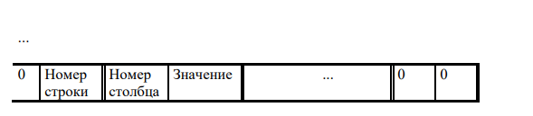
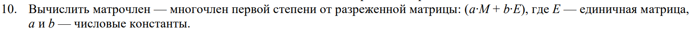

# KP 7
## Вариант размещения матрицы

## Действие с матрицей

## Комментарий
Данные заданы в файле "matrix_for_kp7.txt". В программе я оставила адрес файла на своем компьютере, потому как на данный момент мне неизвестно, как можно сделать иначе.
