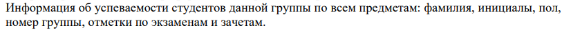
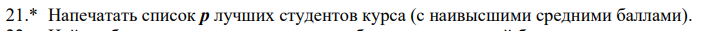

# KP 6
## Данные

## Вариант 21

## Комментарий
Программа берет данные из файла "info.csv" и создает файл "file_for_kp6.txt", куда вводит ответ. Адреса этих файлов указаны, как это было на моем компьютере, так как пока мне неизвестно, как сделать иначе.
